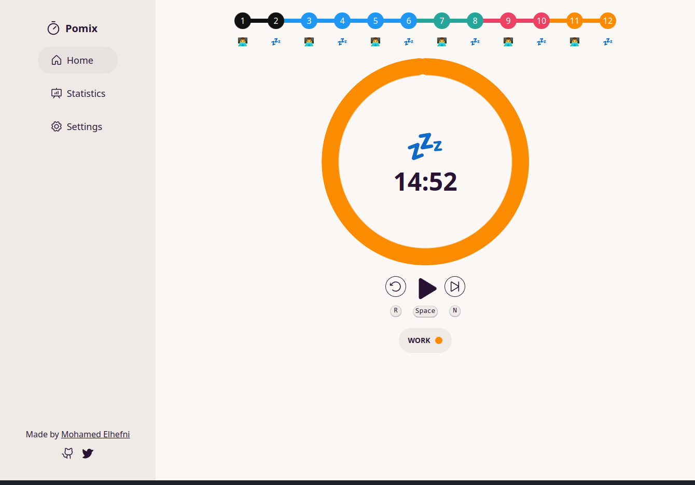
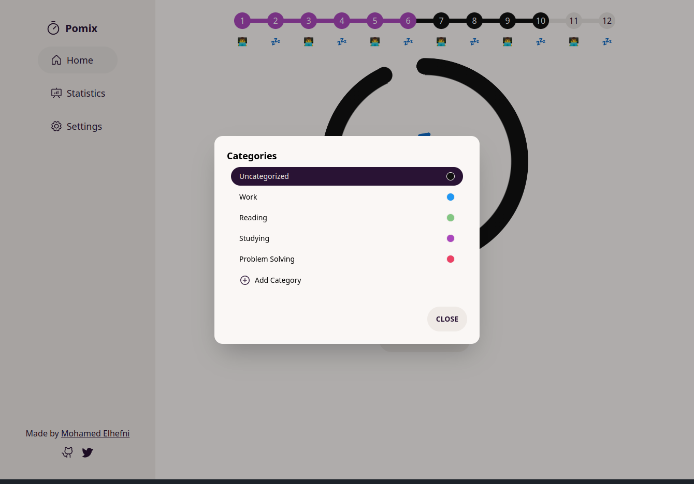
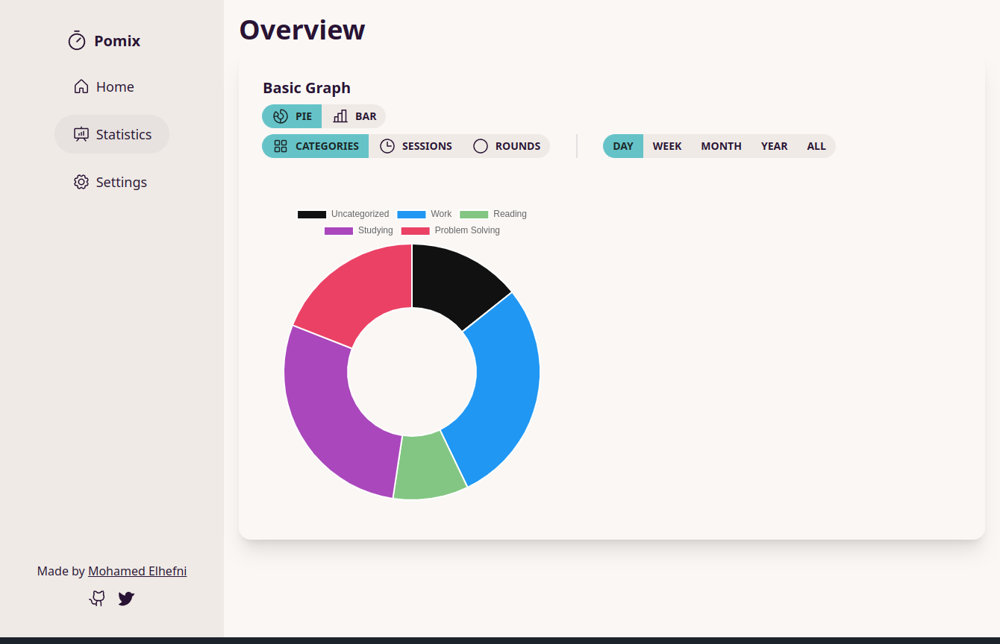
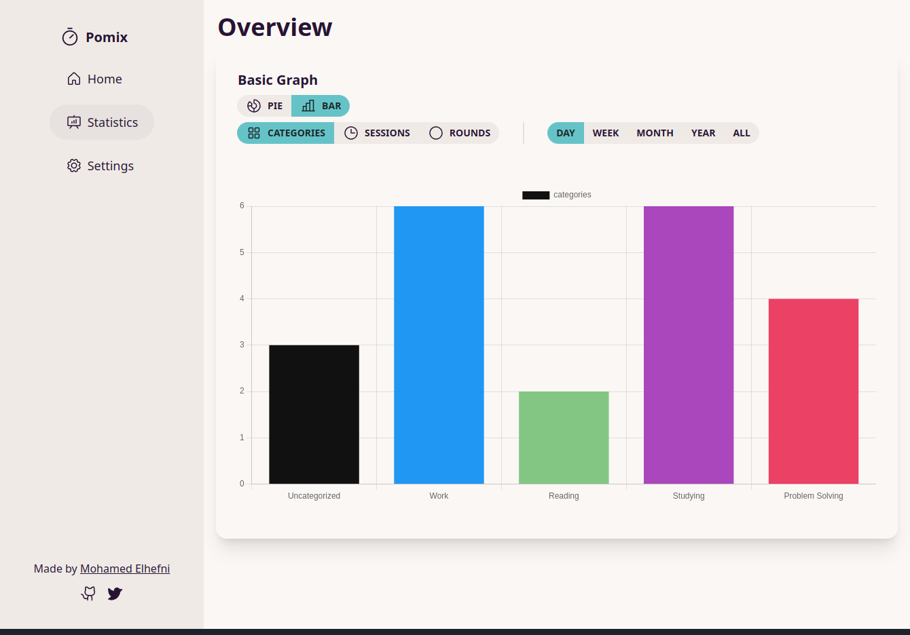
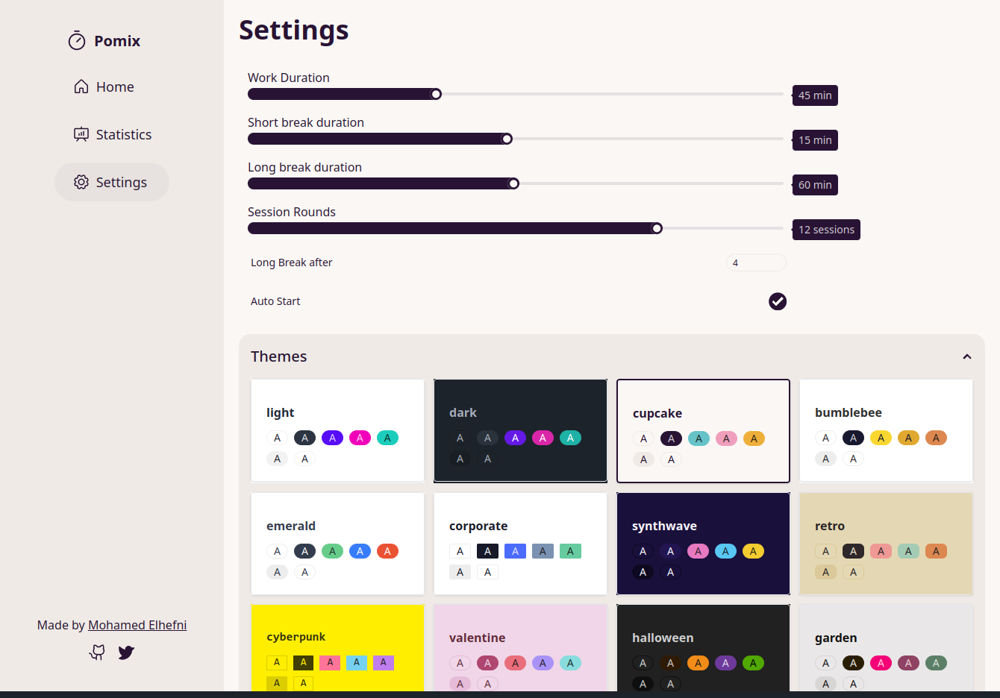

Pomix ⏲️
==========

Pomix is a progressive web app (PWA) that helps you boost your productivity and focus.
Pomix is a combination of pomodoro and mix. Pomodoro is a time management technique that helps you focus and avoid distractions. Mix means that you can mix different categories and tasks in your sessions and get a variety of statistics. Pomix also sounds like remix, which implies that you can customize the app to your liking. 

With Pomix, you can:

-   Create categories for your tasks and track how much time you spend on each one 📝

-   Get fancy statistics for your sessions, rounds and categories 📊

-   Customize everything in the app, such as work duration, long break, short break, session rounds ⚙️

-   Enjoy a simple and elegant user interface 💎

Features
--------

- lets you create unlimited categories 🚀
- shows you how many sessions, rounds and minutes you have completed for each category 📈
- displays graphs and charts to help you visualize your productivity and focus 📉
- allows you to customize the duration of work, short break, long break and rounds 🕑
- has 29 different themes to choose from 🎨
- has a minimalist and user-friendly design 😍
- works offline 💾

Feedback
--------

We would love to hear from you! If you have any suggestions, questions or issues, please contact us at mohamed.elhefni@outlook.com
